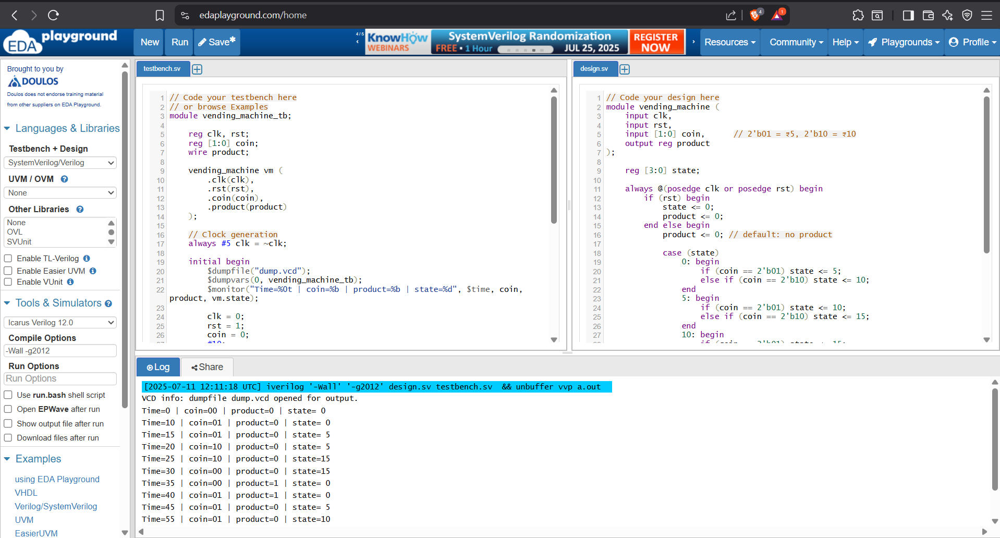

# vending-machine-fsm-verilog
# Vending Machine FSM using Verilog

This project implements a Finite State Machine (FSM) based Vending Machine using Verilog HDL. It simulates the logic of inserting coins and dispensing a product after collecting enough value.

## 📁 Files Included
- `vending_machine.v` - Main FSM design code
- `tb_vending_machine.v` - Testbench to simulate the FSM
- `VendingMachine_FSM_Result.png` - Simulation output (state/coin/product transition)

## 🧪 Simulation
The FSM is tested using a simple Verilog testbench with clock and coin inputs. The system transitions through states and dispenses the product at the right time.

## 💡 Tools Used
- Language: Verilog (2001)
- Simulator: ModelSim / Any Verilog-supported tool

## 📸 Screenshot

## 🔖 Tags
`#Verilog` `#FSM` `#VLSI` `#MiniProject` `#DigitalDesign`

